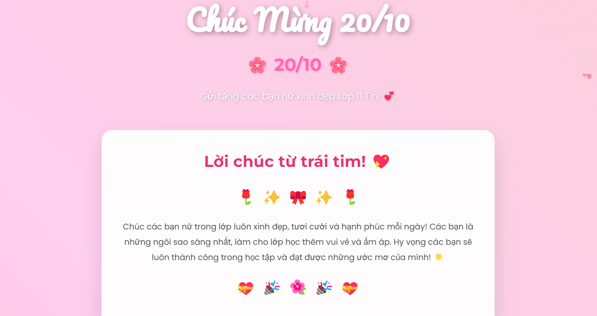

# 💐 Chúc Mừng 20/10 - Dành Tặng Các Bạn Nữ Lớp 12 Tin 💕

Một trang web mini xinh xắn được thiết kế để gửi những lời chúc ngọt ngào và hiệu ứng dễ thương đến các bạn nữ nhân ngày Phụ nữ Việt Nam 20/10!

## 🎉 Tính năng nổi bật

✨ **Hiệu ứng tim bay**  
💖 Các trái tim bay ngẫu nhiên trên toàn màn hình, tạo cảm giác ấm áp và yêu thương.

🎁 **Nút nhận lời khen**  
Nhấn để nhận những lời khen ngợi dễ thương, mang lại nụ cười cho người nhận.

🎆 **Nút pháo hoa**  
Hiệu ứng pháo hoa lấp lánh nhiều màu sắc như một màn chúc mừng sinh động.

🌹 **Thiết kế hiện đại & nhẹ nhàng**  
Giao diện được thiết kế với hiệu ứng gradient nền động, thẻ lời chúc và icon dễ thương.

## 📂 Cấu trúc thư mục
```
.
├── index.html        # Trang HTML chính
├── style.css         # Toàn bộ giao diện & hiệu ứng CSS
└── script.js         # Hiệu ứng JS, tương tác
```

## 🚀 Cách chạy dự án

Chỉ cần mở file `index.html` bằng trình duyệt là bạn có thể trải nghiệm toàn bộ nội dung và hiệu ứng.

> 📌 Không cần cài đặt gì thêm!

## 🖼️ Ảnh minh họa 



## 🛠️ Công nghệ sử dụng

- HTML5
- CSS3 (Flexbox, animation, gradient)
- JavaScript (DOM, event, animation)

## 👩‍🎓 Dành cho ai?

Trang web được tạo ra **đặc biệt dành cho các bạn nữ lớp 12 Tin**, như một món quà nhỏ nhân ngày 20/10 – để gửi yêu thương, sự trân trọng và động viên tích cực.

## 📅 Ngày tạo

20/10/2025

## ❤️ Tác giả

> Được làm với tất cả tình yêu thương 💖  
> &copy; 2025 Hung Vu. Crafted with ❤️ and lots of ☕